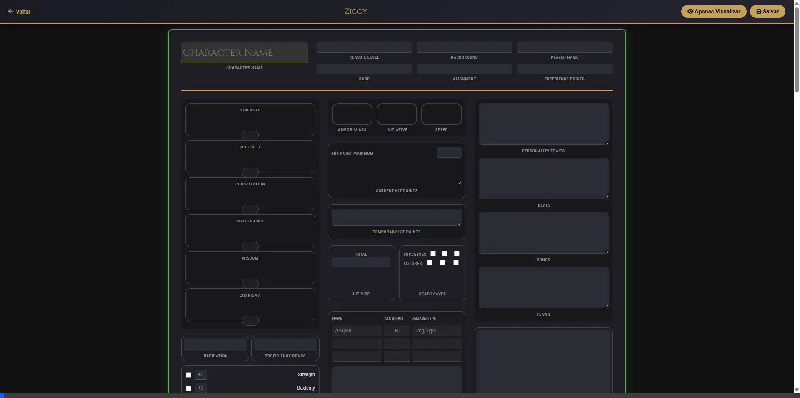
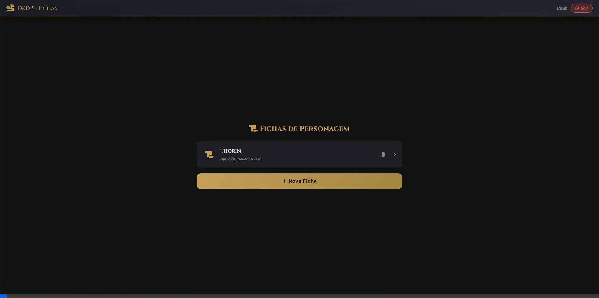

# D&D 5e Character Sheets Web App 🐉🎲

Uma aplicação full-stack para gerenciar fichas de personagem de Dungeons & Dragons 5ª Edição, focada em simplicidade, segurança e uso perfeito em dispositivos móveis.



## Visão Geral

O sistema permite que um grupo de RPG crie e gerencie suas fichas em um ambiente centralizado. Antes uma simples página estática, o projeto foi refatorado para uma verdadeira aplicação **Full-Stack** com backend robusto e banco de dados em nuvem.

### Principais Funcionalidades

- **Autenticação Segura (JWT):** Apenas usuários autorizados (o Mestre) podem acessar as fichas.
- **Fichas Protegidas por Senha:** Cada ficha possui uma "senha de edição". Todos podem visualizar as fichas, mas apenas quem tem a senha pode salvar alterações ou excluir o personagem.
- **Design Mobile-First:** A interface foi reconstruída com CSS Vanilla moderno para funcionar perfeitamente em telas pequenas. No celular, o layout de visualização permite "scroll" horizontal preservando o visual da ficha de papel, enquanto o modo de edição exibe tudo em uma coluna fácil de preencher.
- **Clean Architecture:** O backend foi meticulosamente organizado seguindo os princípios de Clean Architecture, separando Core de Domínio, Casos de Uso (Application), Infraestrutura (Banco de Dados e Segurança) e Endpoints (API).



## Tecnologias Utilizadas

### Backend ⚙️
- **C# / .NET 9.0:** Linguagem e framework de alta performance.
- **ASP.NET Core Web API:** Fornecimento dos endpoints REST.
- **Entity Framework Core:** ORM robusto para o banco de dados.
- **PostgreSQL / Neon.tech:** Banco de dados relacional hospedado na nuvem. (As fichas são salvas em colunas `JSONB` com alta flexibilidade).
- **BCrypt:** Hashes de senha.
- **JWT (JSON Web Tokens):** Gerenciamento de sessão de forma stateless.

### Frontend 🎨
- **HTML5 & Vanilla CSS:** Design limpo, sem frameworks pesados, com uso intenso de CSS Grid e Flexbox.
- **Vanilla JavaScript:** Comunicação dinâmica com a API (`api.js`) e interatividade do DOM, poupando a necessidade de frameworks como React para um sistema pontual.

## Arquitetura do Backend (Clean Architecture)

A organização das pastas no backend (`/backend`) segue a separação de responsabilidades para manter o código testável, manutenível e desacoplado:

- `Domain/`: Entidades de negócio puro (`User`, `CharacterSheet`) e as Interfaces (_Contratos_) dos Repositórios. *Não depende de nada.*
- `Application/`: Regras de negócio, DTOs (Data Transfer Objects) e as Interfaces dos Serviços. Define o fluxo de dados.
- `Infrastructure/`: Implementações concretas. Contém os Repositórios que conversam com o EF Core, Contexto do Banco (`AppDbContext`), e ferramentas de Segurança (`TokenService`, Rate Limiting, BCrypt).
- `API/`: Os `Controllers` que expõem as rotas HTTP e a configuração do Serviço (`Program.cs`).

## Instalação e Execução Local

### Pré-requisitos
- [.NET 9 SDK](https://dotnet.microsoft.com/download)
- [PostgreSQL](https://www.postgresql.org/download/) rodando localmente (ou uma URL de banco na nuvem).

### Passos

1. Clone o repositório:
   ```bash
   git clone https://github.com/herethere04/fichas-D-D.git
   cd fichas-D-D/backend
   ```

2. Configure a String de Conexão no arquivo `appsettings.json`:
   ```json
   "ConnectionStrings": {
     "DefaultConnection": "Host=localhost;Database=dnd_zika;Username=postgres;Password=suasenha"
   }
   ```

3. Instale as dependências e rode as Migrations do banco:
   ```bash
   dotnet restore
   dotnet ef database update
   ```

4. Execute o servidor:
   ```bash
   dotnet run --urls "http://localhost:5000"
   ```

5. O Frontend é servido automaticamente pelo backend! Basta abrir o navegador e acessar:
   👉 **`http://localhost:5000/`**

> _Na primeira execução, o sistema cria automaticamente o usuário padrão `admin` com a senha `mestrejohn`._

## Deploy de Produção 🚀

A aplicação foi preparada para deploy utilizando o **Docker**.
O arquivo `Dockerfile` constrói o backend em C# e expõe tanto a API quanto os arquivos estáticos na porta definida pela nuvem. 

**Exemplo de fluxo para hospedar grátis no Render:**
1. Crie o banco PostgreSQL no **Neon.tech**.
2. Conecte este GitHub no **Render** (como *Web Service* usando Environment *Docker*).
3. Adicione a variável de ambiente:
   - `ConnectionStrings__DefaultConnection` = `SuaURLdoNeonNoFormatoAdoNet`
4. Deploy automático!

---
*“Que os dados rolem sempre a seu favor!”* 🎲
